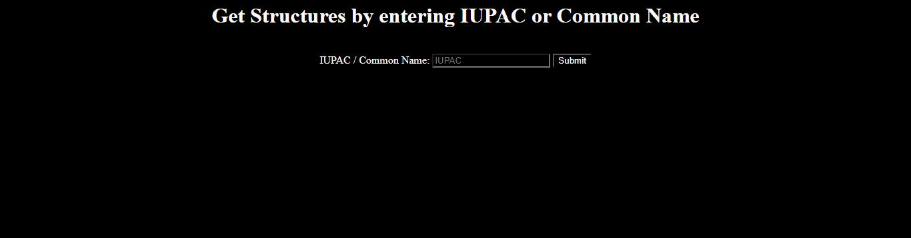
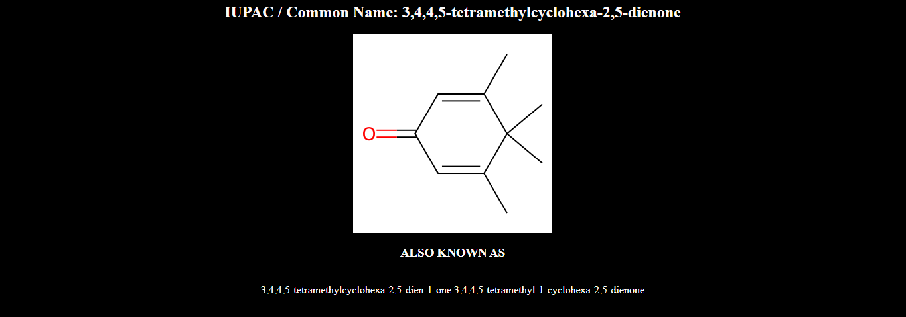

# Chemical Structure from IUPAC or Common Name
This is a simple webpage designed using flask in python which helps a user to find the structure of a compound by inputting the IUPAC or common name.

## Installation
1. Clone this repository
```cmd
git clone https://github.com/At1d1pt/chemical_structure.git

cd chemical_structure
```

2. Install dependencies
```cmd
pip install -r requirements.txt
```

## How to run the project?
Run `main.py` and open https://127.0.0.1:1234/

If this doesn't work, try changing the `PORT` in `main.py`.
You can also set the `DEBUG` to `False`.

## Screenshots



## Resources Used
[rdkit for drawing structures](https://www.rdkit.org/docs/GettingStartedInPython.html)

[This helped me figure out how to get SMILES from IUPAC](https://stackoverflow.com/questions/54930121/converting-molecule-name-to-smiles)